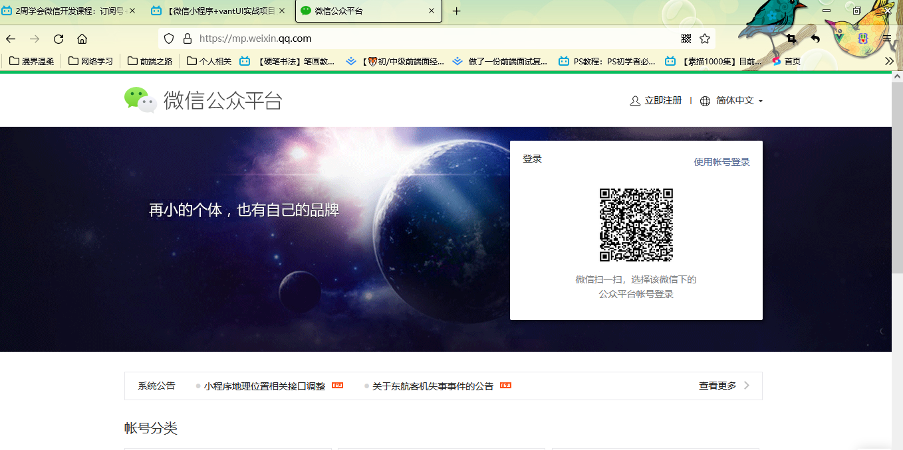
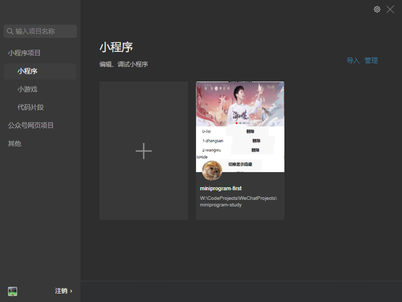

# miniprogram-study
微信小程序的学习记录，微信公众平台账号分类:订阅号、服务号、小程序、企业微信(原企业号)四种

# 1.微信小程序的学习
微信小程序(webchat Mimi program)概述：小意味着快,不需要下载安装即可使用，微信公众平台个人注册账号登录即可，个人注册无法做支付，只有企业账号可以。
https://mp.weixin.qq.com/，微信公众平台注册登陆即可。注意一个邮箱只能选择一种账号类型。
https://developers.weixin.qq.com/miniprogram/dev/framework/ ，小程序开发文档。

登录之后在开发管理中寻找AppID(小程序ID)，在微信开发者工具中新建项目时需要。
然后在微信开发者工具创建项目即可。

小程序结构划分：最上层APP ->  多个pages -> 多个小组件组成一个pages
文件结构：
App 顶层入口
  -app.js，创建App实例以及一些全局设置相关的小程序逻辑代码。
  -app.json，全局的小程序公共配置页面路由信息等。
  -app.wxss，全局的小程序公共样式表。  
  -project.config.json，微信开发者工具本身的一些配置。
Page 页面存放目录
  -page.js，创建Page实例以及一些页面设置相关的逻辑代码。
  -page.json，页面业务的一些配置
  -page.wxml，具体页面的wxml页面结构布局
  -page.wxss，具体页面的样式
Component 组件存放目录
  -compoment.js，创建Component实例以及一些组件设置相关的代码。
  -compoment.json，组件的一些配置
  -compoment.wxml，组件的wxml页面布局
  -compoment.wxss，组件的样式
assets 存放静态资源目录
  -css 存放微信格式的样式文件。

## 1.1全局配置
小程序根目录下的 app.json 文件就是用来对微信小程序进行全局配置的，它决定了页面文件的路径、窗口表现、设置网络超时时间、设置多 tab 等等。常见记住就行记不住就看文档，要注意的是文件内容为一个 JSON 对象所以键值对都要加双引号。
{
  "entryPagePath": "pages/index/index", //指定小程序的默认启动路径（首页），常见情景是从微信聊天列表页下拉启动、小程序列表启动等。如果不填，将默认为 pages 列表的第一项。//

  "pages": ["pages/index/index", "pages/logs/logs"], //用于指定小程序由哪些页面组成，每一项都对应一个页面的 路径（含文件名） 信息。文件名不需要写文件后缀，框架会自动去寻找对应位置的 .json, .js, .wxml, .wxss 四个文件进行处理。新增或删除页面直接对这个数组操作就行。

}
## 1.2页面配置
app.json 中的部分配置，也支持对单个页面进行配置，可以在页面对应的 .json 文件来对本页面的表现进行配置。页面中配置项在当前页面会覆盖 app.json 中相同的配置项。常见如下
{
  "navigationBarBackgroundColor": "#ffffff",导航栏背景颜色
  "navigationBarTextStyle": "black",导航栏标题颜色，仅支持 black / white
  "navigationBarTitleText": "微信接口功能演示",导航栏标题文字内容
  "backgroundColor": "#eeeeee",窗口的背景色
  "backgroundTextStyle": "light"，下拉 loading 的样式，仅支持 dark / light
}

# 2.微信小程序基本语法学习 
整个小程序框架系统分为两部分：逻辑层（App Service）和 视图层（View）。小程序提供了自己的视图层描述语言 WXML 和 WXSS，以及基于 JavaScript 的逻辑层框架，并在视图层与逻辑层间提供了数据传输和事件系统，让开发者能够专注于数据与逻辑。跟vue是类似的,区别在于小程序逻辑层是在js文件中写的，视图层是在wxml文件中写的，而vue是全在vue文件中书写。
## 2.1逻辑层
### 2.1.1小程序初始化入口
每个小程序都需要在入口文件 app.js 中调用 App 方法注册小程序实例且只调用一次，绑定生命周期回调函数、错误监听和页面不存在监听函数等。整个小程序只有一个 App 实例，是全部页面共享的。通过 getApp() 方法获取到全局唯一的 App 实例，获取App上的数据或调用开发者注册在 App 上的函数。很vue类似也是接收一个配置对象，常见配置如下：
// app.js
App({
  onLaunch (options) { 小程序初始化完成时触发，全局只触发一次
    // Do something initial when launch.登陆，本地存储等
  },
  onShow (options) {  小程序启动，或从后台进入前台显示时触发。
    // Do something when show.
  },
  onHide () { 小程序从前台进入后台时触发
    // Do something when hide.
  },
  onError (msg) { 小程序发生脚本错误或 API 调用报错时触发
    console.log(msg)
  },
  onPageNotFound(res) {  小程序要打开的页面不存在时触发，重定向或者回到首页
    wx.redirectTo({
      url: 'pages/...'
    }) // 注意如果是 tabbar 页面，要使用 wx.switchTab方法跳转路由。
  }
  globalData: 'I am global data'
})
// xxx.js
const appInstance = getApp()
console.log(appInstance.globalData) // I am global data

### 2.1.2页面初始化入口
对于小程序中的每个页面，都需要在页面对应的 js 文件中进行注册，指定页面的初始数据、生命周期回调、事件处理函数等。页面也是在js文件中配置，使用的是Page() 进行构造,也是需要传入一个配置对象。常见如下：
//index.js
Page({
  data: {，这里定义的数据就可以在wxml页面中通过双大括号{{}}类似vue的插值表达式取得。
    text: "This is page data."
  },
  onLoad: function(options) {
    // 页面创建时执行
  },
   // 自定义事件响应函数
  viewTap() {
    //修改数据方法，不然页面不会更新。
    this.setData({
      text: 'Set some data for updating view.'
    }, function() {
      // this is setData callback
    })
  },
  // 自由数据
  customData: {
    hi: 'MINA'
  }
})
view{{text}}/view，页面中使用data中的数据。

微信小程序的事件系统：事件是视图层到逻辑层的通讯方式。事件可以绑定在组件上，当达到触发事件，就会执行逻辑层中对应的事件处理函数。

所以组件绑定事件方法如下：跟vue中组件通信类似
1.在组件中绑定一个事件处理函数。
view data-hi="Weixin" bindtap="viewTap"  click me /view
 通过 bindtap 绑定触摸事件，类似pc端中的鼠标点击事件。传参通过固定格式 data-参数名="参数值"
在事件对象event.currentTarget.dataset中保存了{"参数名":"参数值"}

2.在相应的Page定义中写上相应的事件处理函数，接收一个参数event。
Page({
  //绑定事件回调在Page()配置对象中定义。
  viewTap: function(event) {
    console.log(event.currentTarget.dataset),这个对
    console.log('view tap')
    方法中要访问data选项中的数据需要使用 this.data.xxxxx 的形式，同时注意它不是双向绑定的，即直接修改数据页面并不会同步刷新，而是要使用setData 函数显性的声明页面才会刷新。
  }
})

setData 函数用于将数据从逻辑层发送到视图层（异步），同时改变对应的 this.data 的值（同步）。
this.setData({
  属性名：改变后的属性
})

页面路由器对象：可以通过 this.pageRouter 或 this.router 获得当前页面或自定义组件的路由器对象。
页面路由器有 
this.pageRouter.navigateTo == wx.navigateTo
this.pageRouter.switchTab == wx.switchTab
this.pageRouter.reLaunch == wx.reLaunch
this.pageRouter.redirectTo == wx.redirectTo
this.pageRouter.navigateBack == wx.navigateBack
功能相同；唯一的区别是，方法调用时相对路径永远相对于当前 this 指代的页面或自定义组件。
navigateTo, redirectTo 只能打开非 tabBar 页面。
switchTab 只能打开 tabBar 页面。
reLaunch 可以打开任意页面。
也可以使用组件 navigator open-type="navigateTo"/ 指定open-type类型。
小程序中所有页面的路由全部由框架进行管理，以栈的形式维护当前的所有页面。

### 2.1.3小程序组件
Page 构造器适用于简单的页面。但对于复杂的页面， Page 构造器可能并不好用。
此时，可以使用 Component 构造器来构造页面组件。 Component 构造器的主要区别是：方法需要放在 methods: { } 里面。
Component({
  data: {
    text: "This is page data."
  },
  methods: {
    onLoad: function(options) {
      // 页面创建时执行
    },
    onPullDownRefresh: function() {
      // 下拉刷新时执行
    },
    // 事件响应函数
    viewTap: function() {
      // ...
    }
  }
})

## 2.2视图层
小程序框架的视图层由 WXML 与 WXSS 编写，由组件来进行展示。
将逻辑层的数据反映成视图，同时将视图层的事件发送给逻辑层。
WXML(WeiXin Markup language) 
WXSS(WeiXin Style Sheet) 用于描述页面的样式。
WXS(WeiXin Script) 是小程序的一套脚本语言，结合 WXML，可以构建出页面的结构。
组件(Component)是视图的基本组成单元。

WXML（WeiXin Markup Language）是框架设计的一套标签语言，结合基础组件、事件系统，用于描述页面的结构。
### 2.2.1 数据绑定
WXML 中的动态数据均来自对应 Page 的 data
<!--wxml-->
view {{message}} /view
// page.js
Page({
  data: {
    message: 'Hello MINA!'
  }
})
和vue的插值表达式一样，可以作用于内容，同样也能给组件或标签属性添加为动态的需要使用双引号包裹，也可以进行一些简单的运算三元运算符，简单加减，逻辑判断等。

### 2.2.2 条件渲染
使用 wx:if="" 来判断是否需要渲染该代码块，也可以用 wx:elif 和 wx:else 来添加一个 else 块。
如果要一次性判断多个组件标签，可以使用一个 <block/> 标签将多个组件包装起来，并在上边使用 wx:if 控制属性。
注意： <block/> 并不是一个组件，它仅仅是一个包装元素，不会在页面中做任何渲染，只接受控制属性。
wx:if 也是惰性的
<!--wxml-->
view wx:if="{{view == 'WEBVIEW'}}"> WEBVIEW /view>
view wx:elif="{{view == 'APP'}}"> APP /view>
view wx:else="{{view == 'MINA'}}"> MINA /view>
// page.js
Page({
  data: {
    view: 'MINA'
  }
})

### 2.2.3 列表渲染
在组件上使用 wx:for 控制属性绑定一个数组，即可使用数组中各项的数据重复渲染该组件。
默认数组的当前项的下标变量名默认为 index，数组当前项的变量名默认为 item。。
可以时使用wx:for-index="idx" 给index重新指定名称，可以使用wx:for-item="student"给item重新命名。
使用 wx:key 来指定列表中项目的唯一的标识符可以提高列表渲染时的效率。
view >
  view wx:for="{{list}}" wx:key="item">
      view>{{index}}-{{item}}/view> 
  /view>
/view>
// page.js
Page({
  data: {
    list:['lisi','zhangsan','wangwu'],
    classArr:[
      {id:'1',classFS:'1班',students:['zhangsan','lisi','wangwu']},
      {id:'2',classFS:'2班',students:['Jack','rose','ereasion']}
    ],
  }
})
//多维数组
view wx:for="{{classArr}}" wx:key="id">
  {{item.classFS}}共有text wx:for="{{item.students}}" wx:key="index" wx:for-item="student">{{student}}-/text>共{{item.students.length}}名学生
/view>

### 2.2.4 模板
WXML提供模板（template），可以在模板中定义代码片段，然后在不同的地方调用。
定义一个模板指定name属性作为模板的名字
template name="staffName">
  这里面就是模板的内容
  view>
    FirstName: {{firstName}}, LastName: {{lastName}}
  /view>
/template>
使用模板，通过is属性指定使用哪个模板，通过data属性向模板内传递数据。
template is="staffName" data="{{...staffA}}">/template>
template is="staffName" data="{{...staffB}}">/template>
template is="staffName" data="{{...staffC}}">/template>

// page.js
Page({
  data: {
    staffA: {firstName: 'Hulk', lastName: 'Hu'},
    staffB: {firstName: 'Shang', lastName: 'You'},
    staffC: {firstName: 'Gideon', lastName: 'Lin'}
  }
})

### 2.2.5 引用
WXML 提供两种文件引用方式import和include。
import可以在该文件中使用目标文件定义的template，如：
在 item.wxml 中定义了一个叫item的template：
<!-- item.wxml -->
template name="item">
  text>{{text}}/text>
/template>
在 index.wxml 中引用了 item.wxml，就可以使用item模板：
import src="item.wxml"/>
template is="item" data="{{text forbar}}"/>

注意：import 有作用域的概念，即只会 import 目标文件中定义的 template，而不会 import 目标文件 import 的 template。

include 可以将目标文件除了 template/> wxs/> 外的整个代码引入，相当于是拷贝到 include 位置
<!-- index.wxml -->
include src="header.wxml"/>
view> body /view>
include src="footer.wxml"/>

<!-- header.wxml -->
view> header /view>

<!-- footer.wxml -->
view> footer /view>

### 2.2.6 WXSS 
WXSS(WeiXin Style Sheets)是一套样式语言，用于描述 WXML 的组件样式。跟css属性语法没什么差别
与 CSS 相比，WXSS 扩展的特性有：尺寸单位，样式导入。定义在 app.wxss 中的样式为全局样式，作用于每一个页面。在 page 的 wxss 文件中定义的样式为局部样式，只作用在对应的页面，并会覆盖 app.wxss 中相同的选择器。
#### 1.尺寸单位
rpx（responsive pixel）: 可以根据屏幕宽度进行自适应。规定屏幕宽为750rpx。如在 iPhone6 上，屏幕宽度为375px，共有750个物理像素，则750rpx = 375px = 750物理像素，1rpx = 0.5px = 1物理像素。

#### 2.样式导入
使用@import语句可以导入外联样式表，@import后跟需要导入的外联样式表的相对路径，用;表示语句结束。
@import './assets/css/common.wxss';

## 2.3小程序数据双向绑定
小程序本身目前是没有双向绑定的语法指令，利用value属性和input事件可以自己实现。
input type="text" value="{{invalue}}" bindinput="vmodel"/>
view>{{invalue}}/view>
Page({
  data: {
    invalue:'默认值'
  },
  //数据双向绑定
  vmodel(e){
    const {value} = e.detail //通过事件属性的detail对象可以取的用户输入的值。
    this.setData({
      invalue:value
    })
  },
})

## 2.4小程序基础组件
框架为开发者提供了一系列基础组件，开发者可以通过组合这些基础组件进行快速开发。
组件是视图层的基本组成单元，一个组件通常包括 开始标签 和 结束标签，属性 用来修饰这个组件，内容 在两个标签之内。注意：所有组件与属性都是小写，以连字符-连接
所有组件都有以下属性：
属性名 	类型 	描述 	注解
id 	String 	组件的唯一标示 	保持整个页面唯一
class 	String 	组件的样式类 	在对应的 WXSS 中定义的样式类
style 	String 	组件的内联样式 	可以动态设置的内联样式
hidden 	Boolean 	组件是否显示 	所有组件默认显示
data-* 	Any 	自定义属性 	组件上触发的事件时，会发送给事件处理函数
bind* / catch* 	EventHandler 	组件的事件 	

# 3.微信小程序API学习
小程序开发框架提供丰富的微信原生 API，可以方便的调起微信提供的能力，如获取用户信息，路由跳转，本地存储，支付功能等。主要还是看文档，常见如下：

